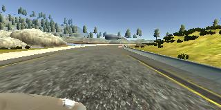

# Behavioral-Cloning

\
Car drives autonomously in a simulator. CNN predicts steering angle based on an image in real-time.

## Overview

In this project I trained CNN to clone driving behaviour. CNN architecture I used was based on NVIDIA's paper [End-to-End Learning for Self-Driving Cars](https://images.nvidia.com/content/tegra/automotive/images/2016/solutions/pdf/end-to-end-dl-using-px.pdf).

It's the project from Udacity's Self-Driving Car Engineer nanodegree program. The steps involved were the following:
* Use the simulator to collect data of good driving behavior
* Design, train and validate a model that predicts a steering angle from image data
* Use the model to drive the vehicle autonomously around the first track in the simulator. The vehicle should remain on the road for an entire loop around the track
* Summarize the results here

### Dependencies
This lab requires [CarND Term1 Starter Kit](https://github.com/udacity/CarND-Term1-Starter-Kit). The lab enviroment can be created with CarND Term1 Starter Kit. Click [here](https://github.com/udacity/CarND-Term1-Starter-Kit/blob/master/README.md) for the details.

* [Udacity's simulator](https://github.com/udacity/self-driving-car-sim) was used for this project. 

## Details About Files In This Directory

My project includes the following files:
* model.py containing the script to create and train the model
* drive.py for driving the car in autonomous mode
* video.py used to create video out of images
* video.mp4 video of car autonomously driving on the first track in simulator
* model.h5 containing a trained convolution neural network 
* model_weights.h5 containing trained weights of NN
* trainHistoryDict pickle file containing training history

### `drive.py`

Usage of `drive.py` requires you have saved the trained model as an h5 file, i.e. `model.h5`. 

Once the model has been saved, it can be used with drive.py using this command:

```sh
python drive.py model.h5
```

The above command will load the trained model and use the model to make predictions on individual images in real-time and send the predicted angle back to the server via a websocket connection.


#### Saving a video of the autonomous agent

```sh
python drive.py model.h5 run1
```

The fourth argument, `run1`, is the directory in which to save the images seen by the agent. If the directory already exists, it'll be overwritten.

The image file name is a timestamp of when the image was seen. This information is used by `video.py` to create a chronological video of the agent driving.

### `video.py`

```sh
python video.py run1
```

Creates a video based on images found in the `run1` directory. The name of the video will be the name of the directory followed by `'.mp4'`, so, in this case the video will be `run1.mp4`.

Optionally, one can specify the FPS (frames per second) of the video:

```sh
python video.py run1 --fps 48
```

Will run the video at 48 FPS. The default FPS is 60.

---

## Model Architecture and Training Strategy

### Architecture Overview

CNN architecture I used was based on NVIDIA's paper [End-to-End Learning for Self-Driving Cars](https://images.nvidia.com/content/tegra/automotive/images/2016/solutions/pdf/end-to-end-dl-using-px.pdf).

This is the original NVIDIA's CNN architecture. The only thing that differs is image's original input sizes, which in our case is `160x320`.


Here is the network summary from kera's `model.summary()` method:
```
_________________________________________________________________
Layer (type)                 Output Shape              Param #   
=================================================================
crop_1 (Cropping2D)          (None, 65, 320, 3)        0         
_________________________________________________________________
normalize_1 (Lambda)         (None, 65, 320, 3)        0         
_________________________________________________________________
conv_1 (Conv2D)              (None, 31, 158, 24)       1824      
_________________________________________________________________
conv_2 (Conv2D)              (None, 14, 77, 36)        21636     
_________________________________________________________________
conv_3 (Conv2D)              (None, 5, 37, 48)         43248     
_________________________________________________________________
conv_4 (Conv2D)              (None, 3, 35, 64)         27712     
_________________________________________________________________
conv_5 (Conv2D)              (None, 1, 33, 64)         36928     
_________________________________________________________________
flatten_1 (Flatten)          (None, 2112)              0         
_________________________________________________________________
dense_1 (Dense)              (None, 100)               211300    
_________________________________________________________________
dense_2 (Dense)              (None, 50)                5050      
_________________________________________________________________
dense_3 (Dense)              (None, 10)                510       
_________________________________________________________________
dense_4 (Dense)              (None, 1)                 11        
=================================================================
Total params: 348,219
Trainable params: 348,219
Non-trainable params: 0
_________________________________________________________________
```

**Summary of the model**:
* The model consists of 2 preprocessing steps, first cropping the image and then normalizing to zero mean and range -0.5 to 0.5:
```lambda x: (x / 255.0) - 0.5```
* There are 5 convolutional layers with 5x5 and 3x3 filter sizes and depths between 24 and 64.
* Three fully connected layers, plus final node to produce steering angle output.
* The model includes RELU layers to introduce nonlinearity.

### Model Overfitting, Regularization

The model does not use dropout, max/avg pooling or other regularization techniques, as based on training history the model didn't overfit, and performed well on both training and validation sets.

The model was tested by running it through the simulator and ensuring that the vehicle could stay on the track.

### Model parameter tuning

The model used an adam optimizer, so the learning rate was not tuned manually. Batch size is set to 25. 5 epochs were used for training.

### Training data

Training data was chosen to keep the vehicle driving on the road. I used [simulator driving data](https://d17h27t6h515a5.cloudfront.net/topher/2016/December/584f6edd_data/data.zip) that was collected by Udacity.


### Solution Design Approach

The overall strategy for deriving a model architecture was to copy already successful CNN model architecture from [NVIDIA's paper](https://images.nvidia.com/content/tegra/automotive/images/2016/solutions/pdf/end-to-end-dl-using-px.pdf). This model has 5 convolutional layers, which enables the network to learn complex visual patterns with each new layer. Conv layers are followed by 3 interconnected layers, which enables to learn complex patterns based on already learned complex visual patterns by previous 5 conv layers. 

In order to gauge how well the model was working, I split my image and steering angle data into a training and validation set. Validation set split is 20% of the whole data set.

At the end of the process, the vehicle is able to drive autonomously around the track without leaving the road - see recorded video in `video.mp4` file.

### Creation of the Training Set & Training Process

Driving data includes mostly good driving data behaviour, and also vehicle recovering from the left side and right sides of the road track back to center, so that the vehicle would learn to drive back to center once it's near the edge of the lane/road. There are recordings for left, center, and right cameras: 

 \
Center Camera

 \
Left Camera

 \
Right Camera

#### Cropping
Images were cropped from top and bottom to avoid unecessary distractions which do not relate to the road.
 \
Cropped Image

#### Angles Correction for Left and Right Cameras

As per NVIDIA's paper, I used images from left and right cameras and adjusted angles, to help train the model to recover from edges, even if only good driving behaviour is collected. 

Here is a code snippet of angle correction:
```python
steering_center = float(row[3])
correction = 0.2
steering_left = steering_center + correction
steering_right = steering_center - correction
```

#### Data Augmentation

To augment the data set, I also flipped images along x axis and angles thinking that this would help model generalize better to turn left or right, no matter if training data only included examples of left or right turning.

Generating flipped images happened inside the python generator function, during the model training itself.

After each epoch, I randomly generate all samples again in the python generator:
```python
def generator(samples, batch_size=32):
    num_samples = len(samples)
    while 1:
        random.shuffle(samples)
        for offset in range(0, num_samples, batch_size):
            # ....
```

Optimal number of epochs turned out to be 5. Looking at training history, I could see that validation loss kept decreasing after even first epochs, but not much after 5th epoch. 
Here is the training history train and validation loss:


All in all, there are 24108 original collected images from left, center, and right cameras, plus flipped images, which doubles to 48216 samples in the whole data set. Validation set is 20% of that data.

## Future Improvements

Future improvemets would be to generalize the model even more by driving on different tracks. I could use **transfer learning** to use already-learned weights of the current model, and keep fine-tuning the model based on the new data.

Another approach could be to augment the network with already trained robust convolutional layers from some popular nets competing in ImageNet, such as VGG, ResNet, Inception etc, to help recognize visual patterns.
